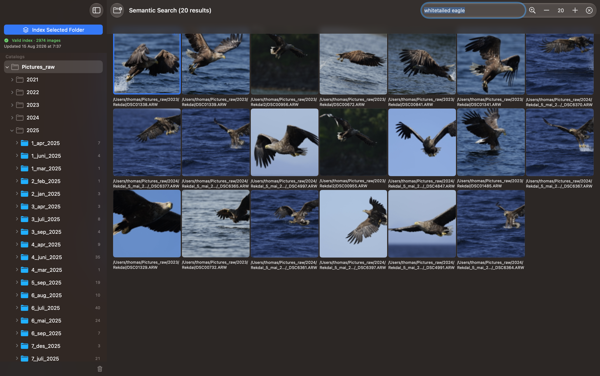

# macOS apps by rsyncOSX

Native macOS applications for file synchronization, photo culling, and private on-device image search.

All three applications are actively developed, and their core processing stays on your Mac.

| Application | Purpose | Requirements |
| --- | --- | --- |
| [RsyncUI](#rsyncui) | Graphical file synchronization with `rsync` | macOS Sonoma or later |
| [RawCull](#rawcull) | GPU-accelerated Sony RAW photo culling | Apple Silicon, macOS Sequoia or later |
| [RawCullFB](#rawcullfb) | Private semantic image search using local AI | Apple Silicon, macOS Golden Gate beta |

---

## RsyncUI

[](https://github.com/rsyncOSX/RsyncUI/blob/main/Licence.MD)


A native SwiftUI interface for [`rsync`](https://github.com/WayneD/rsync) that makes synchronization tasks easier to configure, organize, and schedule. RsyncUI configures and runs `rsync`; all file synchronization is performed by `rsync` itself.

[Download](https://github.com/rsyncOSX/RsyncUI/releases) · [Documentation](https://rsyncui.netlify.app/docs/) · [Release notes](https://rsyncui.netlify.app/blog/) · [Report an issue](https://github.com/rsyncOSX/RsyncUI/issues)

```shell
brew install --cask rsyncui
```

**Requires macOS Sonoma or later.** The latest release is [v3.0.3](https://github.com/rsyncOSX/RsyncUI/releases), released August 7, 2026. RsyncUI is signed and notarized by Apple.


---

## RawCull

[](https://github.com/rsyncOSX/RawCull/blob/main/Licence.MD)

A fast, native photo-culling application for Sony ARW files. RawCull uses GPU-accelerated analysis—including EXIF extraction, focus-point detection, sharpness scoring, and visual saliency—to help you identify your strongest photographs.

[Download from the Mac App Store](https://apps.apple.com/no/app/rawcull/id6759362764?mt=12) · [GitHub releases](https://github.com/rsyncOSX/RawCull/releases) · [Documentation](https://rawcull.netlify.app/docs/) · [Release notes](https://rawcull.netlify.app/blog/)

**Requires Apple Silicon.** The current release, v2.3.5, supports macOS Sequoia and later. A v3.0.0 beta with AI-powered features is available for macOS Golden Gate beta. See the [documentation](https://rawcull.netlify.app/docs/) for supported Sony full-frame camera bodies.


---

## RawCullFB

[](https://github.com/rsyncOSX/RawCullFB/blob/main/Licence.MD)

A private, on-device photo browser with natural-language search. RawCullFB uses local CLIP indexing to search JPEG, PNG, HEIC/HEIF, TIFF, and Sony ARW files—without uploading your photographs. Model inference, image embeddings, and search all stay on your Mac.

[Download](https://github.com/rsyncOSX/RawCullFB/releases)

**Requires Apple Silicon and macOS Golden Gate beta.** The latest release is [v2.4.0](https://github.com/rsyncOSX/RawCullFB/releases), released August 15, 2026. RawCullFB is sandboxed, signed, and notarized by Apple.



---

If these applications are useful to you, consider starring their repositories. Feedback and issue reports are always welcome.
