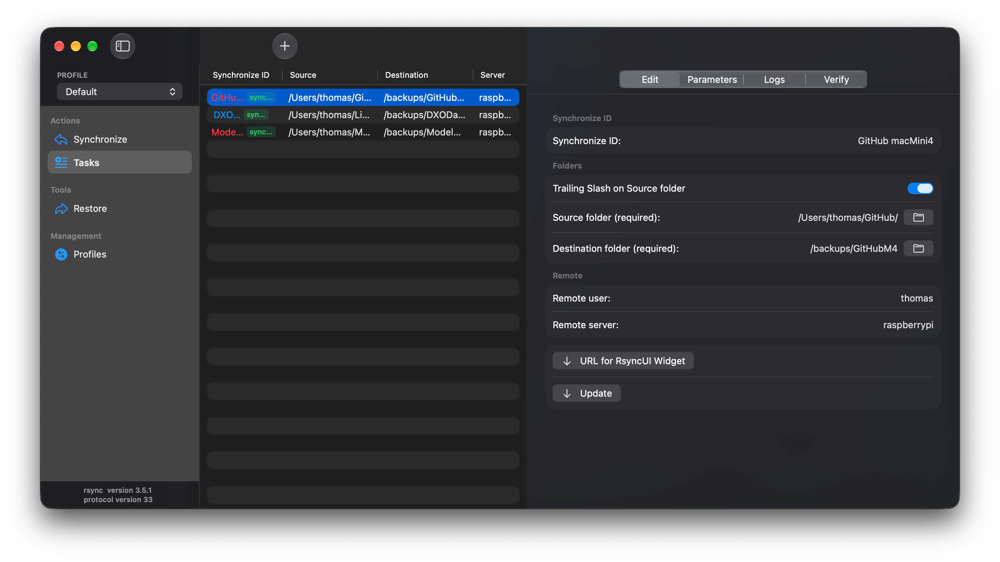

# macOS apps by Thomas (rsyncOSX)

Native macOS applications for file synchronization, photo culling, and private on-device image search. All four (five) applications are actively developed, and their core processing stays on your Mac.

| Application | Purpose | Requirements |
| --- | --- | --- |
| [RsyncUI](#rsyncui) | Graphical file synchronization with `rsync` | macOS Sonoma and later |
| [RawCull](#rawcull) | AI-assisted Sony RAW photo culling | Apple Silicon, macOS Golden Gate |
| [GitBranchStatus](https://github.com/rsyncOSX/GitHubLocalRemote) | small app to display status local vs GitHub repository  | Apple Silicon, macOS Tahoe and later |

---

## RsyncUI

[](https://github.com/rsyncOSX/RsyncUI/blob/main/Licence.MD)


[](https://github.com/rsyncOSX/RsyncUI/issues)

A native SwiftUI interface for [`rsync`](https://github.com/WayneD/rsync) that makes synchronization tasks easier to configure, organize, and schedule. RsyncUI configures and runs `rsync`; all file synchronization is performed by `rsync` itself.

[Download](https://github.com/rsyncOSX/RsyncUI/releases) · [Documentation](https://rsyncui.netlify.app/docs/) · [Release notes](https://rsyncui.netlify.app/blog/) · [Report an issue](https://github.com/rsyncOSX/RsyncUI/issues)

```shell
brew install --cask rsyncui
```

Requires **macOS Sonoma or later.** The latest release is [v3.0.5](https://github.com/rsyncOSX/RsyncUI/releases), released September 10, 2026. RsyncUI is signed and notarized by Apple. 



---

## RawCull

[](https://github.com/rsyncOSX/RawCull/blob/main/Licence.MD)
[](https://www.apple.com/macos/)
[](https://www.swift.org/)

A fast, native photo-culling application for **Sony ARW** files. RawCull uses GPU-accelerated analysis—including EXIF extraction, focus-point detection, sharpness scoring, and visual saliency—to help you identify your strongest photographs.

Requires **macOS Golden Gate** on **Apple Silicon Macs**.  [RawCull v3.2.8](https://github.com/rsyncOSX/RawCull/releases/tag/v3.2.8) with AI-powered features is released. 

[Download from the Mac App Store](https://apps.apple.com/no/app/rawcull/id6759362764?mt=12) · [Documentation](https://rawcull.netlify.app/docs/) · [Release notes](https://rawcull.netlify.app/blog/)


