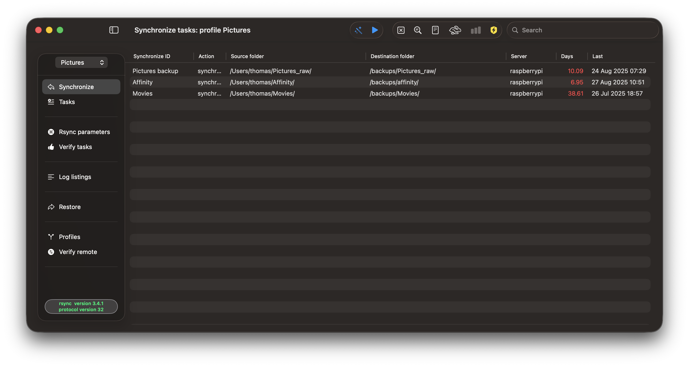

# RsyncUI

This is [the repository for RsyncUI](https://github.com/rsyncOSX/RsyncUI), a SwiftUI based macOS application. RsyncUI is released for *macOS Sonoma and later*. RsyncUI is a GUI on the Apple macOS platform for the command line tool [rsync](https://github.com/WayneD/rsync). It is `rsync` which executes the synchronize data tasks. The GUI is *only* for organizing tasks, setting parameters to `rsync` and make it easier to use `rsync`.

| Homebrew | macOS versions |   Latest version   |
| ----------- |   ----------- | ----------- |
| `brew install --cask rsyncui`    | macOS Sonoma and later | v2.9.0 - [January 29, 2026](https://github.com/rsyncOSX/RsyncUI/releases) - in *active development* |
| |  | [documentation](https://rsyncui.netlify.app/docs/) and [changelog](https://rsyncui.netlify.app/blog/) |

If you find RsyncUI useful, I would appreciate it if you could consider giving me a star on [the repository](https://github.com/rsyncOSX/RsyncUI). Your support helps drive further development!

The [user documentation](https://rsyncui.netlify.app/docs/) is based upon a fork of the excellent Hugo based theme [Docsy](https://github.com/google/docsy). RsyncUI might be installed by Homebrew or by direct download. It is *signed* and *notarized* by Apple.

---

# RawCull

RawCull is a macOS app designed to help you quickly and efficiently cull large sets of Sony ARW A1 mkI and mkII raw photos. With a streamlined interface and powerful selection tools, RawCull makes it easy to review, compare, and select your best images.

| Release | macOS versions |   Latest version   |
| ----------- |   ----------- | ----------- |
|  | - macOS 26 Tahoe and later 
- **Apple Silicon** (M-series) only | v1.0.6  - [February 22, 2026](https://github.com/rsyncOSX/RawCull/releases)  - in *active development* |
| |  | [documentation](https://rawcull.netlify.app/docs/) and [changelog](https://rawcull.netlify.app/blog/) |

